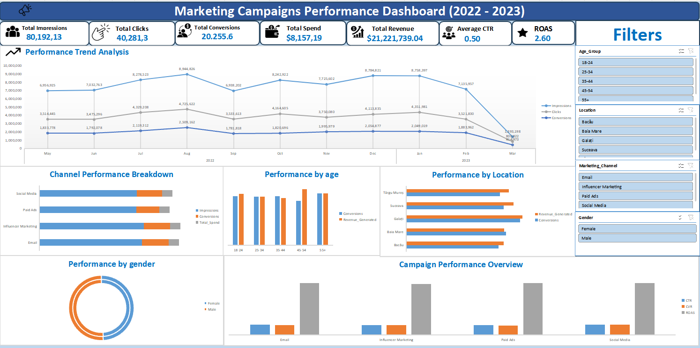

# Marketing Campaigns Performance Analysis & Interactive Excel Dashboard

## Project Overview

An end-to-end marketing campaign analysis project built with Microsoft Excel and Power Query to evaluate campaign performance, marketing efficiency, customer demographics, and revenue generation across multiple digital channels.

The project analyzes 2,000 campaign records across:

- Email Marketing
- Paid Ads
- Social Media
- Influencer Marketing

## Objective

The main goal was to evaluate campaign effectiveness, identify revenue drivers, measure marketing efficiency, and provide insights to support future campaign optimization and budget allocation decisions.

## Tools & Technologies

- Microsoft Excel
- Power Query
- Pivot Tables
- Slicers
- Advanced Excel Formulas
- Data Visualization
- Interactive Dashboard

## What I Did

### Data Preparation & ETL

- Cleaned and transformed 2,000 campaign records using Power Query.
- Standardized data types and datetime fields.
- Removed data inconsistencies and prepared the dataset for analysis.

### Marketing KPI Analysis

Calculated and analyzed key marketing performance metrics:

| KPI | Formula |
|---|---|
| CTR | Clicks / Impressions |
| CVR | Conversions / Clicks |
| CPC | Spend / Clicks |
| CPA | Spend / Conversions |
| ROAS | Revenue / Spend |
| ROI | (Revenue - Spend) / Spend |

### Performance Analysis

Analyzed campaign performance across:

- Marketing Channel
- Location
- Age Group
- Gender
- Revenue
- Marketing Spend
- Conversions
- Engagement Metrics

## Interactive Dashboard

The Excel dashboard includes:

- KPI Cards
- Channel Performance Analysis
- Spend vs Revenue Analysis
- Demographic Analysis
- Geographic Analysis
- Interactive Slicers
- Marketing Efficiency Metrics

## Key Results

### Overall Performance

- **Total Marketing Spend:** $8.16M
- **Total Revenue:** $21.22M
- **Overall ROAS:** 2.60x
- **Overall ROI:** 160.16%

### Channel Performance

- **Paid Ads** achieved the highest ROAS at **2.62x**.
- **Social Media** achieved the highest CTR at **51.56%** and CVR at **51.00%**.
- **Email Marketing** achieved the lowest CPA at **$0.38 per conversion**.

### Demographic & Geographic Insights

- **Galați** generated the highest revenue at approximately **$4.73M**.
- **Suceava** ranked second with approximately **$4.36M**.
- The **45–54 age group** generated the highest revenue at approximately **$4.65M** and achieved a **2.62x ROAS**.

## Dashboard Preview

## Project Files

| File | Description |
|---|---|
| `Marketing_Campaigns_Analysis.xlsx` | Complete Excel analysis, Power Query transformations, calculations, Pivot Tables, and interactive dashboard |
| `dashboard-preview.png` | Preview of the final interactive dashboard |

## Key Takeaway

The analysis indicates that **Paid Ads provided the strongest overall return**, while **Social Media demonstrated strong engagement and conversion performance**. These findings can support future campaign optimization and marketing budget allocation.

---

**Project Type:** Marketing Data Analysis  
**Tools:** Excel • Power Query • Pivot Tables • Data Visualization  
**Dataset Size:** 2,000 campaign records
